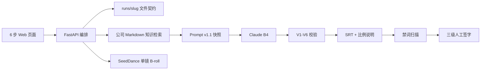

# 海外短视频本地化 MVP · 架构与实施步骤

## 1. 结论

原有根目录适合人工素材归档，但不具备页面、接口、状态机、提示词版本和调用审计，因此不能单独视为“可运行 MVP”。

当前采用双层结构：

- 根目录：原始素材、翻译、字幕、剪辑、导出、归档等业务资产。
- `overseas-loc-mvp/`：页面化工作流、模型接口、知识检索与单条主题运行产物。

## 2. 最小转化链路

## 3. PRD 对标

| PRD | 页面/接口 | 落盘 |
|---|---|---|
| B0–B3 | `POST /api/brief` | Brief、Gate |
| B2 | `POST /api/storyboard` | 分镜 Markdown + 结构化 JSON |
| 知识检索 | `POST /api/knowledge/search` | 单独检索不落盘；B4 快照中保留证据 |
| B4 | `POST /api/localize` | request、prompt、EN 包、meta |
| B4 备选 | `POST /api/localize/import` | 人工输出 + fallback meta |
| B4b | `POST /api/compliance/scan` | compliance-report |
| B5a/B5b | `POST /api/srt` | SRT、比例说明、QA |
| SeedDance | `POST /api/seedance/broll` | request、mp4、meta |

## 4. 已修正的接口问题

1. PRD 示例模型 `claude-sonnet-4-20250514` 已退役，默认改为 `claude-sonnet-4-6`，并通过环境变量配置。
2. fal.ai SeedDance 2.0 当前模型 ID 不含 `/fast/`。
3. 图生视频使用 `image_urls` 数组且图片必填；没有图片时切换到 text-to-video。
4. Prompt 从 v1.0 升为 v1.1，新增 `company_knowledge_context`，但明确禁止知识库扩大 claims 白名单。
5. 每次 B4 保存完整 `prompt-snapshot.json`，解决“提示词逻辑不可追溯”。

## 5. 本地实施步骤

### 步骤一：启动

双击根目录 `启动页面MVP.cmd`，打开 `http://127.0.0.1:8787`。

### 步骤二：配置接口

编辑 `overseas-loc-mvp/.env`：

- `ANTHROPIC_API_KEY`：Claude Messages API。
- `FAL_KEY`：fal.ai SeedDance 2.0。
- `KNOWLEDGE_RESEARCH_ROOT`：公司知识库本地目录；多个目录用英文分号分隔。

### 步骤三：跑夜奶样例

1. Step 1 保存 Brief，B0 可保持 NO-GO，但 `allowed_claims_available` 必须为 true。
2. Step 2 确认 Shot 1–5，只有氛围镜标 `[AI_BROLL]`。
3. Step 3 检查知识库能返回产品与合规证据。
4. Step 4 先用本地演示验证文件链路，再配置 Claude 真跑。
5. Step 5 必须得到 `compliance = PASS`。
6. Step 6 先保存 SeedDance 请求预览，再用已审核图片生成 1 条视频。

### 步骤四：跑护罩尺寸样例

复制同样流程，新建 `flange-size-v1`，只允许使用已批准的 `multiple flange sizes` 等白名单表述。

### 步骤五：领导验收

每条主题检查：

- 10 个 PRD 核心文件是否齐全。
- `localize-meta.json` 是否记录 provider、model、prompt_version。
- `compliance-report.json` 是否 PASS。
- SRT 是否可导入剪辑软件。
- SeedDance 是否只处理 AI_BROLL。
- `qa-checklist.md` 是否完成三级签字。

## 6. 当前仍需公司提供

- Anthropic 与 fal.ai 的公司 Key。
- `allowed_claims_en` 的维护人和书面批准方式。
- 国内母版 `master_video_id` 与素材使用权。
- 至少一张已审核场景图用于真实 image-to-video。
- 商品、合规、海外市场三方签字人。
- 上线前法务对母婴英文 claims 和 AIGC 标识要求的最终确认。

## 7. MVP 后再做

- NAS 自动同步。
- 用户登录和权限。
- 数据库与任务队列。
- 多条任务并发、成本面板和失败重跑。
- 自动剪辑、整片生成和平台投放 API。

